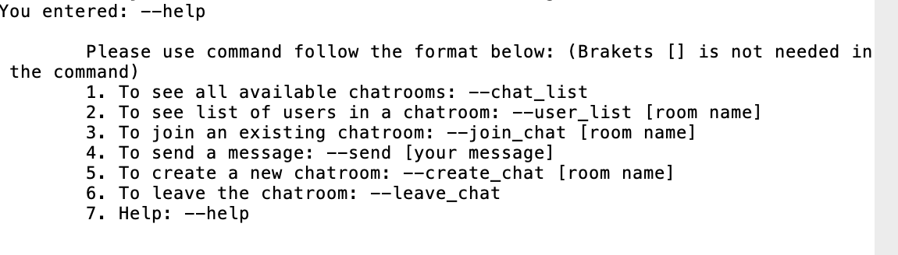
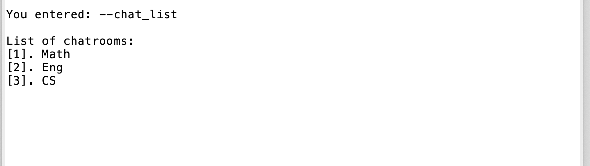
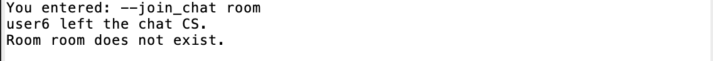
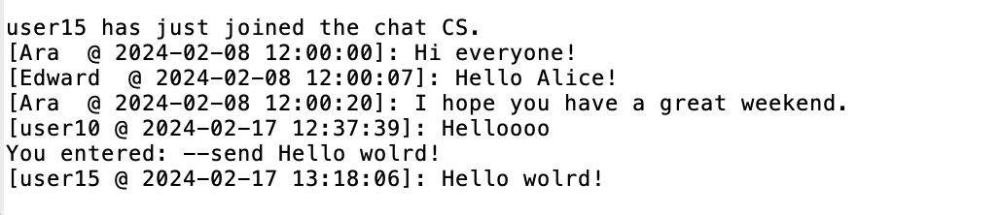
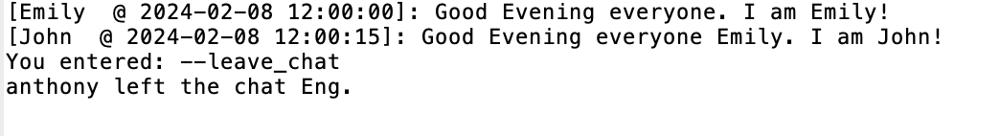
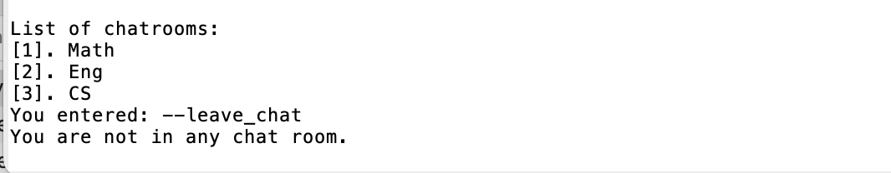

```
Nhan Nguyen 
Assignment 1 - COMP 4300 - Chat gRPC
```
Make sure that you already completed all the setup steps for grpc: https://grpc.io/docs/languages/python/quickstart/

# Activate virtual environment:

```source chat-grpc-env/bin/activate```

# Install all necessary packages:

```python3 -m pip install -r requirements.txt```

# Run server:
```python3 server.py```

# Run client:
```python3 client.py```

# After running client, this prompt will pop up:
## Enter username:


### Note:
- Username can be any character(s) but empty.
- Username should be unique (my program has not verified this, but it should be for the sake of the database storage).
- As log as you enter something, that will be registered as your username and the GUI chatbox will pop up after this is successfully created. 

# After login, the chat application is good to use, below are some commands users can use:

## 1. Help: 
```--help```

This will show what commands users can use. 


## 2. List of Chatrooms:
### To see the list of available chatrooms, use this command:
```--chat_list ```
### Note: 
- Initially, it loads the database from chat_db.json file to fetch some existing chatrooms and some users in that chats together with the hstory conversation, so it is expected to see some chatrooms there. 
- chat_pb2.json currently has room Math, Eng, and CS so those will be listed.

### How to interpret the output:
- The output is the list of available chatrooms from the time the server starts running, this includes any rooms that were loaded from the database.

- If any other user creates a new room during the time this command is executing, the new room will be showed in the list as well. 

- The command is still executing (keep getting the response from the server stream) until the user enters new command.

i.e: If the list of chatrooms is: Math, Eng, CS. The output should look like




## 3. List of connected users for each room:

### To see the list of connected user for room Math for example, use this command:
```--user_list Math```

### How to interpret the output:
- The output is the list of connected users in the chat room. (Connected users include users that are executing --join_chat [room])

- If any other user joins the room during the time this command is executing, that new user will be showed in the list as well. 

- The command is still executing (keep getting the response from the server stream) until the user enters new command.

i.e: If the list of connected users in room Math is: Alice, Clara, Thanh. The output should look like:


- The total number of users in the chat room is the last number before the last username. 

- However, this list is staled if any user leaves the chat, the list show cannot remove the leaving user. The command needs to be called again to get the updated result. 

- If the room does not exist, it will show a notification for that and terminate the execution, the output will be like this:


## 4. Join existing chat room:
### To join room CS (an existing room), use:
```--join_chat CS```
### How to interpret the output:
- The output loads all chat history of users in the chat room.
For example, there were some conversations in the CS room database, so it will look like this:


- If the user does not execute any other command (except --send), the user is still in the chat and will receive any new messages from others instantly

- If user enter any command rather than --send message, the user will automatically leave the room. 

- If the room does not exist, the user is notified that.



- If the room is full, the user is also notified. 


## 5. Create a chat room:
### To create a new room with room name is comp4300, use:
```--create_chat comp 4300```
### How to interpret the output:
- The output notifies to let the user know the new room is created.


- If the room name is occupied, the user is also notified the room cannot be created with exiting rooms names.

### Note: --creat_chat will not let user join the new room, user needs to use --join_chat new room to join the new room.

## 6. Send a message:
### To send a message "Hello wolrd!" in the room CS, firstly, user need to join the room:
``` --join_chat CS```
and then user can send the message:
```--send Hello wolrd!```
- If the user is already in a chat, do not need to --join_chat again

### How to interpret the output:
- If the user is in the chat, all users in the chat will see the new message shown.


- If the user is not in the chat, the user will be notified.


## 7. Leave chat 
### To leave any chat user is currently in, use:
```--leave_chat ```
### How to interpret the output:
- If the user was in a chat room, it would let the user know they successfully left the room.



- If the user was not in any chat, the user would be notified about that.



# Live demo and testing:
Please refer to the documentation in folder docs.


# References:
GUI: https://github.com/melledijkstra/python-grpc-chat

