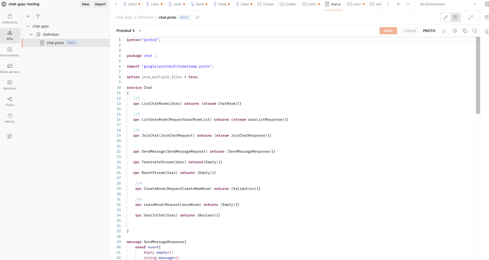
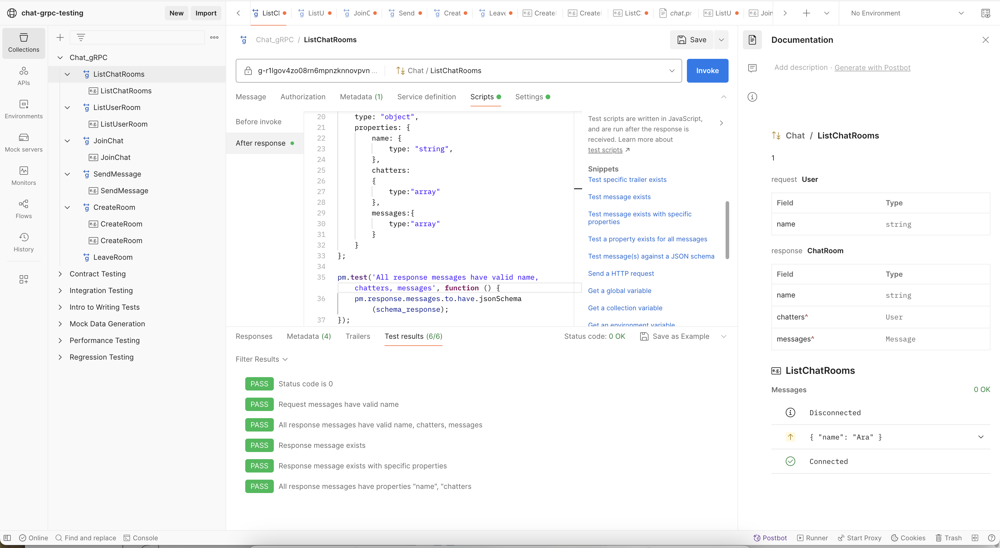
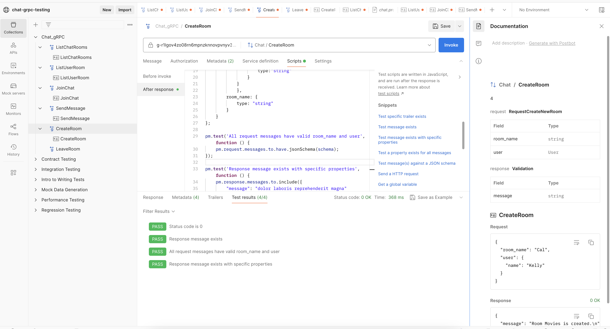
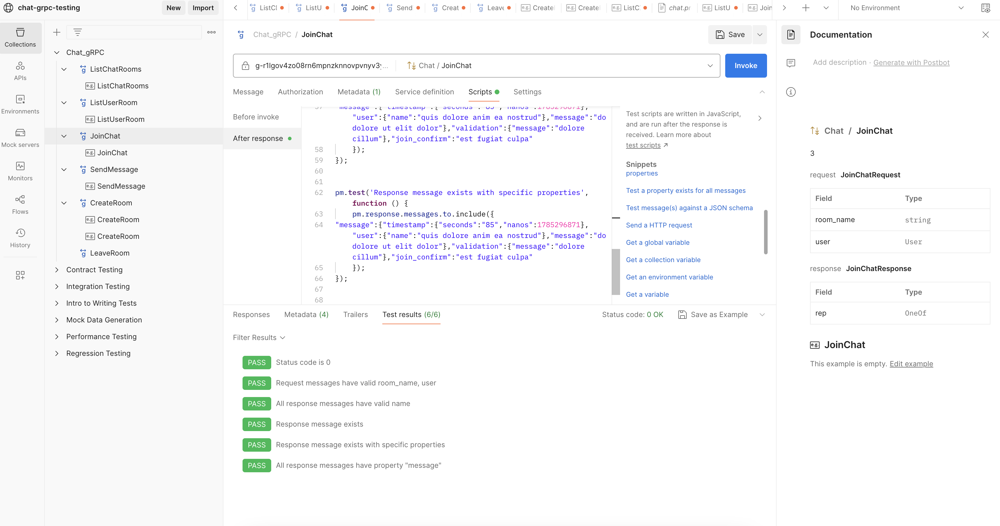
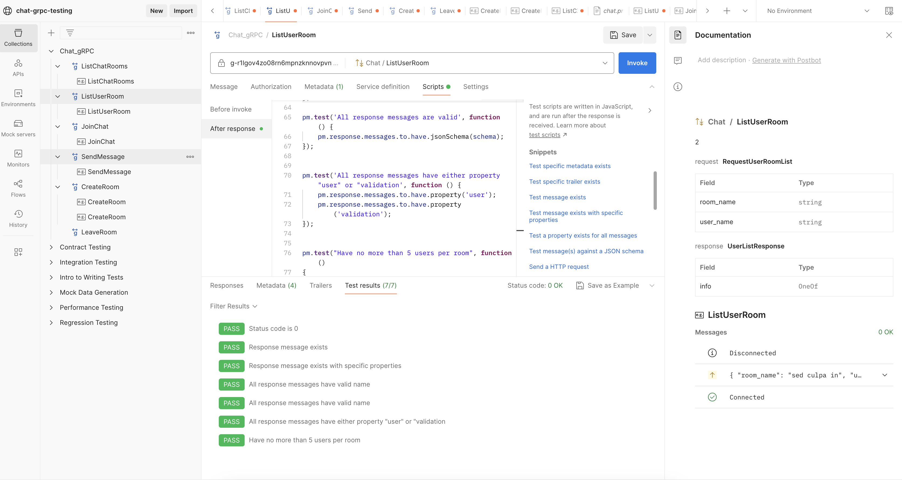
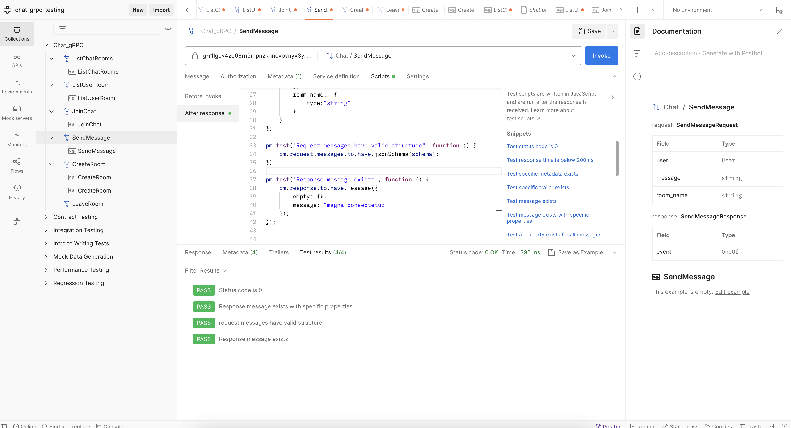
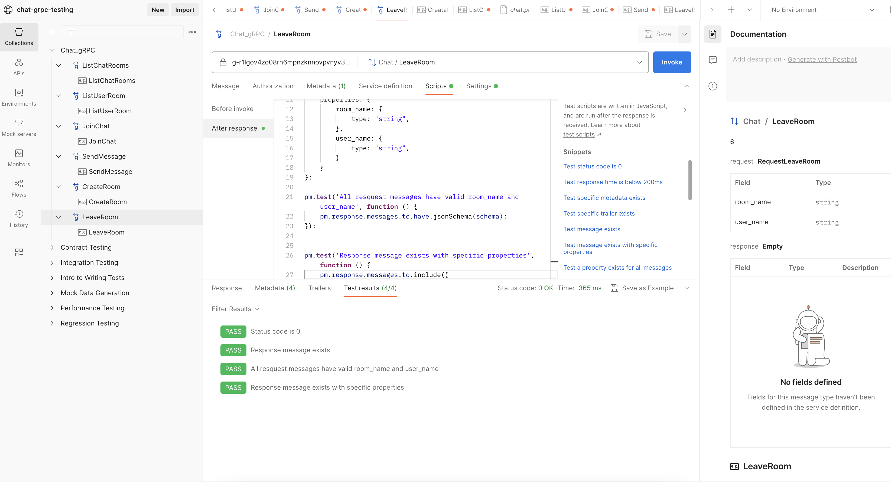

### Public tests: https://www.postman.com/orange-zodiac-60388/workspace/chat-grpc-testing/collection/65d130d7af0c01151a5cc1a8?action=share&creator=30379959

The testing was made with Postman.

## Steps to create tests: (those are already completed). 
### 1. Create API
chat-grpc.proto

### 2. Add new gRPC request

### 3. Enter url: select the protobuf API created above

### 3. Select a method

### 4. Create request, update metadata and write tests

# List of all tests for each method:
- To replicate the tests, choose the method you want to run the test and hit the button 'Invoke' (the blue button on the top right corner)
- Examples for the request and response are also included in the code, documentation for those were auto generated by Postman. 

## Chat list tests:

## Create room tests:

## Join room tests:

## User list tests:

## Send message tests:

## Leave chat tests:
